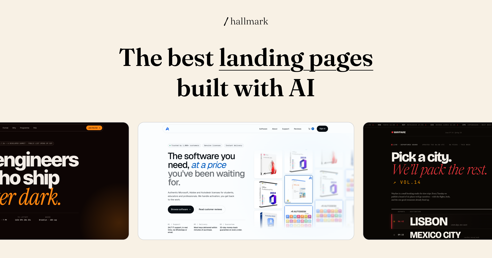
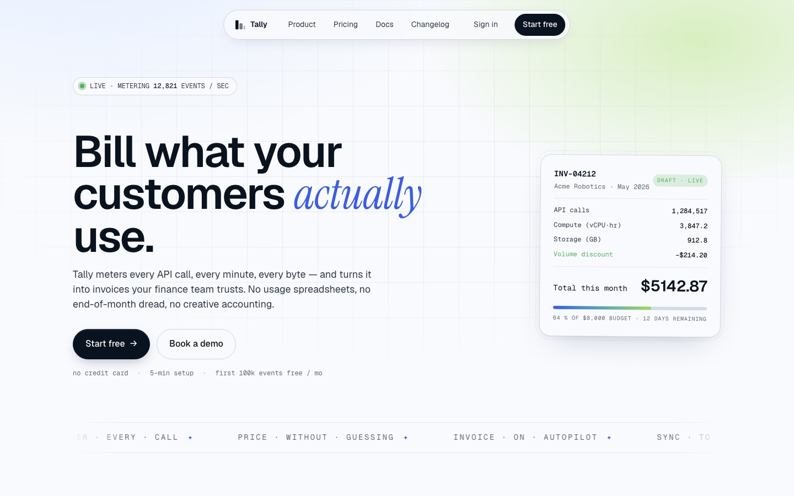
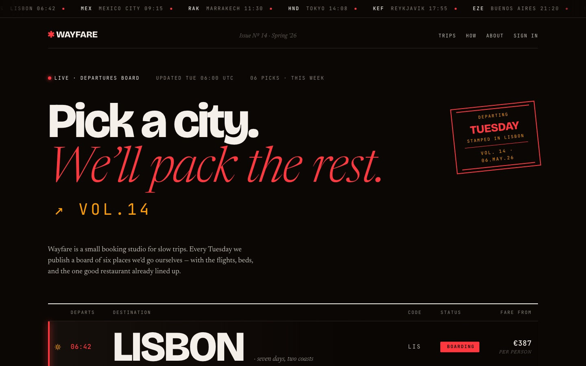
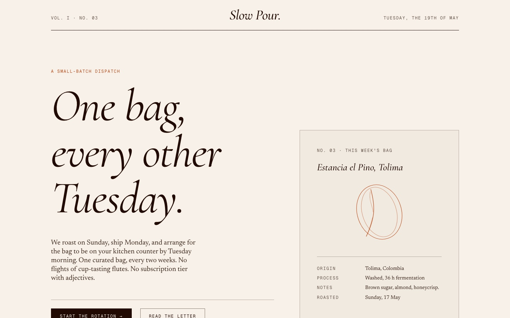
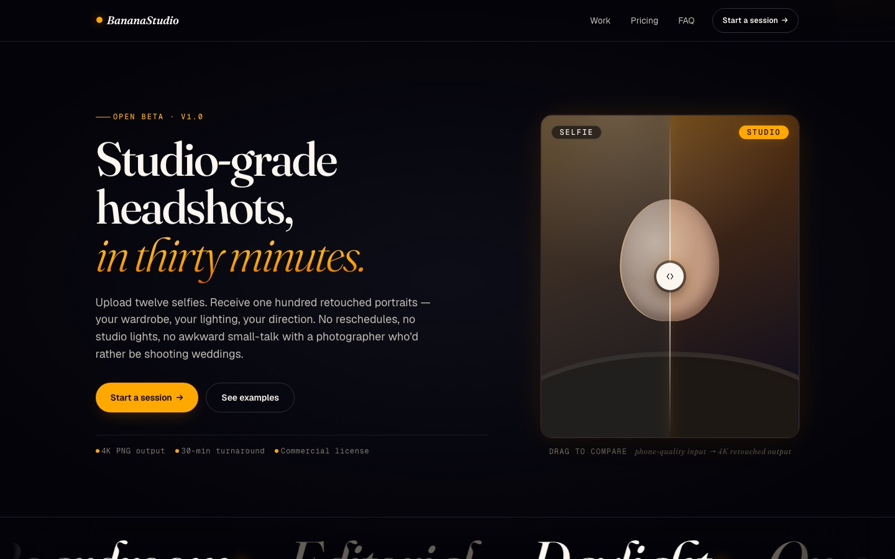
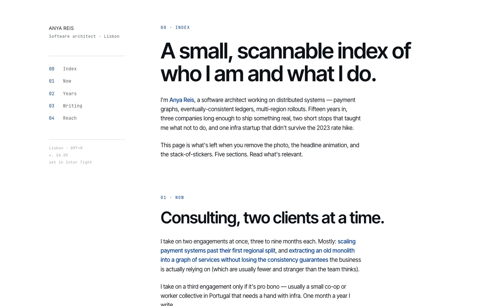
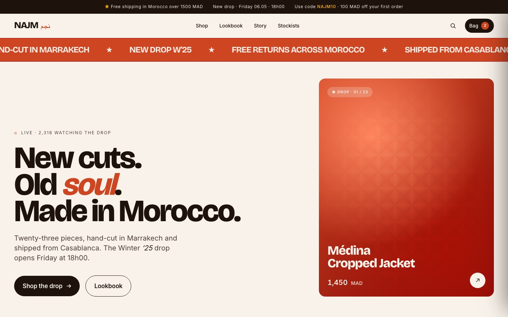
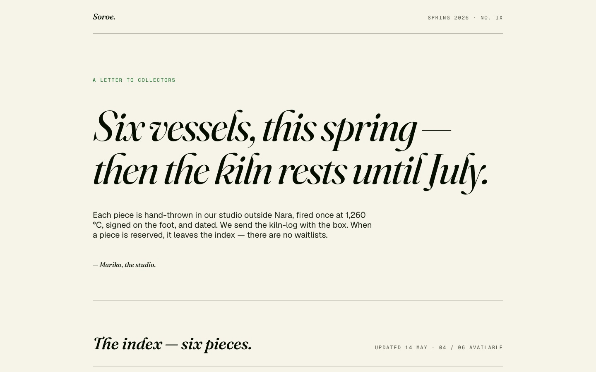
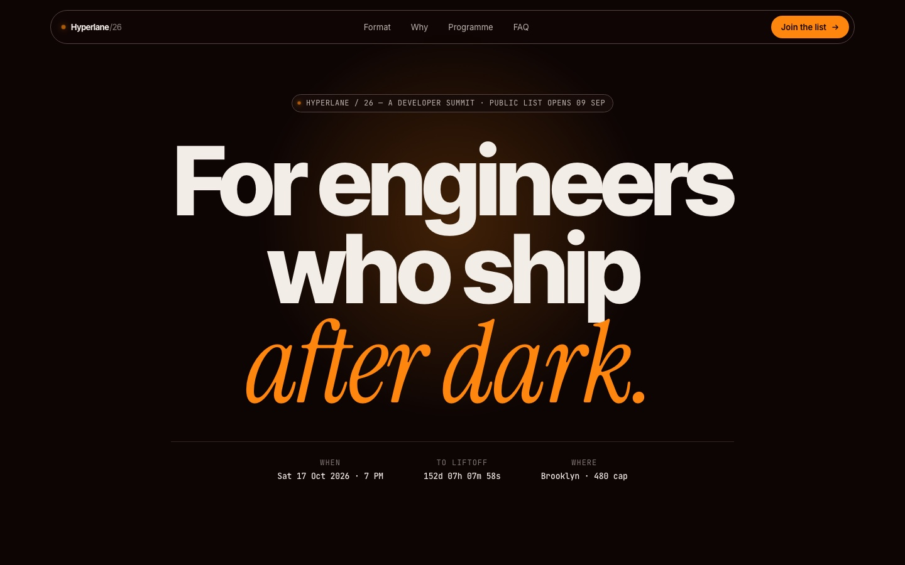

# Hallmark

**A design skill for Claude Code, Cursor, and Codex that refuses to look AI-generated.**

[Live demo →](https://www.usehallmark.com) &nbsp;·&nbsp; twenty-two themes &nbsp;·&nbsp; four verbs &nbsp;·&nbsp; press `T` to cycle.

Made by Together AI.

<p align="center">
  
</p>

Hallmark encodes the anti-AI-slop consensus — typography, colour, layout, motion, microinteractions, structural variety — into one opinionated rule-set. It picks a macrostructure for the brief, dresses it in one of twenty-two themes, runs sixty-five slop-test gates plus a pre-emit self-critique before handing back, and refuses the on-distribution defaults every LLM was trained into.

> **v1.0.0** — pre-emit critique on six axes, honest-copy enforcement, locked-token discipline, re-drawn-chrome ban, and a no-wrap rule for clickable text. Five new slop-test gates (56–60). The full rule-set lives in [`SKILL.md`](SKILL.md) and [`references/`](references/).


---

## What's distinct — quick map vs the field

|  | Hallmark | [frontend-design](https://github.com/anthropics/skills) (Anthropic) | [Open Design](https://github.com/nexu-io/open-design) | [Dembrandt](https://github.com/dembrandt/dembrandt) |
| --- | --- | --- | --- | --- |
| **Source of taste** | extracts DNA from a screenshot OR a URL (`study` verb) — image mode names roles + candidates; URL mode names exact fonts + tokens | art-director brief + ban list | menu of 72 brand presets (Linear, Stripe, Vercel, Notion…) | scrapes a live URL, emits computed tokens |
| **Output unit** | macrostructure + theme + custom-craft, optional portable `design.md` | bans + brief framing | preset application | DTCG `tokens.json` |
| **Refuses font ID** | image mode: yes — names role only; URL mode: names what the page declares | n/a | n/a | n/a (computes from CSS) |
| **Refuses pixel-clone** | yes — DNA only, never pixels (both modes) | n/a | n/a | n/a (full token export) |
| **Refuses third-party extraction** | yes — paid templates / competitors / unrelated sites auto-refused; `design.md` emission has a tighter layer with URL-mode attestation | n/a | n/a | n/a (extracts anything) |
| **Tactile-rebellion alignment** | warm-paper, custom-craft, slopless canon | strong | medium | none — token-only |
| **Pages by archetype** | 21 named macrostructures, picked per brief | by brief | 5 deterministic directions | n/a |
| **Verbs** | 4 (default · `audit` · `redesign` · `study`) | 1 | 31 | 1 (CLI) |

Hallmark's edge is **`study`** — every other tool ships a preset menu or a scraper. Hallmark is the only one that takes a screenshot *or* a URL of a design you admire, names what it sees (roles in image mode, exact fonts + tokens in URL mode), refuses paid-template-marketplace listings outright, and either rebuilds your content with the extracted DNA or emits a portable `design.md` you can hand to another AI tool — with a tighter refusal layer for the portable spec than for the diagnosis itself. Three worked study examples in [`docs/study-examples.md`](docs/study-examples.md).

---

## Four verbs

| Verb | What it does |
| --- | --- |
| *(default)* | Build new UI. Asks for audience + use + tone (skippable — the skill states what it inferred). Picks a macrostructure, applies the rule-set, runs the slop test before handing back. |
| `hallmark audit <target>` | Score existing code against the named anti-patterns + structural sameness. Punch list, no edits. |
| `hallmark redesign <target> [--mood <name>]` | Throw out the structure, keep copy + IA + brand, rebuild with a deliberately different fingerprint. |
| **`hallmark study <screenshot \| URL>`** | The differentiator. Extract the **DNA** from a design the user admires — macrostructure, archetypes, type-pairing, colour anchor — and produce a diagnosis report. Accepts either an attached screenshot or a URL to a live page. After the diagnosis the user can optionally rebuild *their* content using the extracted DNA, **or** lock the DNA into a portable `design.md` other AI tools (Cursor, v0, Bolt) can read directly. **URL mode** reads HTML / CSS via WebFetch — names exact fonts and exact colour values, can't judge rhythm, and falls back to asking for a screenshot if the page is auth-walled or a JS-only shell. **Refuses paid templates and competitor pages. Image mode names font roles (never font IDs); URL mode names actual fonts (the page declares them). Never copies pixels. `design.md` emission has a tighter refusal layer than the diagnosis itself — URL-mode emission asks the user to attest the source is theirs or a public reference for their own brand.** |

---

## Different briefs, different shapes

A handful of examples below — each generated by exercising the skill on a different brief. The skill picks differently for every prompt; no two share a macrostructure or theme.

<table>
  <tr>
    <td width="25%"><a href="https://www.usehallmark.com/examples/tally/"></a></td>
    <td width="25%"><a href="https://www.usehallmark.com/examples/wayfare/"></a></td>
    <td width="25%"><a href="https://www.usehallmark.com/_tests/09-slow-pour/"></a></td>
    <td width="25%"><a href="https://www.usehallmark.com/examples/bananastudio/"></a></td>
  </tr>
  <tr>
    <td><b>Tally</b><br/><sub>SaaS product page · modern-minimal</sub></td>
    <td><b>Wayfare</b><br/><sub>Travel booking · atmospheric</sub></td>
    <td><b>Slow Pour</b><br/><sub>Small-batch coffee subscription</sub></td>
    <td><b>BananaStudio</b><br/><sub>Creative studio · playful motion</sub></td>
  </tr>
  <tr>
    <td><a href="https://www.usehallmark.com/_tests/06-anya-portfolio/"></a></td>
    <td><a href="https://www.usehallmark.com/examples/najm/"></a></td>
    <td><a href="https://www.usehallmark.com/_tests/11-soroe-ceramics/"></a></td>
    <td><a href="https://www.usehallmark.com/examples/hyperlane/"></a></td>
  </tr>
  <tr>
    <td><b>Anya Reis</b><br/><sub>Software architect personal site</sub></td>
    <td><b>NAJM</b><br/><sub>Moroccan fashion brand</sub></td>
    <td><b>Søroe</b><br/><sub>Small ceramics studio</sub></td>
    <td><b>Hyperlane</b><br/><sub>Developer infrastructure</sub></td>
  </tr>
</table>

Each page is its own self-contained HTML + CSS — no shared theme, no shared layout. Every one carries a `/* Hallmark · macrostructure: … */` stamp at the top of its CSS. See the full set under [`site/_tests/`](site/_tests/) or live at [www.usehallmark.com](https://www.usehallmark.com).

---

## What's inside

- **[`SKILL.md`](SKILL.md)** — the routing file. Six-step design flow (including `Step 2.5 · Check project memory` reading `.hallmark/log.json`), 65-gate slop test, output contract, always-on `tokens.css` export.
- **[`references/`](references/)** — short, opinionated rule files: typography, colour, layout, motion, microinteractions, interaction-and-states (with the input-state checklist), responsive, copy, anti-patterns, the 21 named macrostructures, the **40 component archetypes** with variation knobs (9 hero · 6 feature · 4 CTA · 4 testimonial · **8 footer · 9 nav**), the **4 hero polish patterns** (in `hero-enrichment.md`), the 6 primitive structure axes, the vision-extraction protocol for `study`, hero enrichment, custom-craft (CSS art over Lottie), assets, the slop-test gates, four genre rule-overlays (each with nav + footer voice routing), per-verb dispatchers, and the export-formats reference (Tailwind / DTCG / shadcn / tokens.css).
- **[`docs/`](docs/)** — human-reading content: **[`recipes.md`](docs/recipes.md)** (8 worked briefs + a canonical try-it prompt) and **[`study-examples.md`](docs/study-examples.md)** (3 worked DNA-extractions). Not auto-loaded by the skill.
- **[`site/`](site/)** — a self-demonstrating landing page. Hand-written HTML + CSS + ES module, no framework, no build step. **Twenty-two themes** clustered into four genres: **editorial** (Specimen, Editorial, Atelier, Newsprint, Salon, Linen, Almanac, Garden, Studio, Sport, Riso, Brutal, Manifesto), **modern-minimal** (Quiet, Coral, Violet), **atmospheric** (Midnight, Terminal, Bloom, Aurora, Halo), **playful** (Plume). Switching themes literally rebuilds the page — different hero archetype, different footer archetype, different nav archetype.

---

## What's distinct (the long list)

- **One skill, four verbs.** Not eighteen commands.
- **Genres broaden the range.** Hallmark routes a brief through one of four genres before picking a theme: **editorial** (default · the canonical anti-slop voice), **modern-minimal** (Stripe / Linear / ElevenLabs school), **atmospheric** (Suno / Runway / dark-AI-tool school), **playful** (post-Linear soft school). Each genre is its own rule overlay — atmospheric allows radial blooms; modern-minimal allows pure white and pill CTAs; editorial bans both. Detection is signal-based, silent default to editorial.
- **Tone is a first-class decision.** "Clean and modern" is rejected. Pick an extreme — *editorial · brutalist · soft · technical · luxury · playful · austere*.
- **Macrostructures over axes.** Pick one of 21 named whole-page shapes wholesale; the macrostructure stamp lives in the CSS comment, so the next Hallmark run picks something different.
- **Within-archetype variation.** Two Bento Grids should not be twins; each archetype has 2–3 picked-per-output knobs.
- **Microinteractions as discipline.** Silent success over celebratory toasts. Optimistic update + Undo over confirm dialogs. Hover delay 800 ms, focus delay 0 ms.
- **A 65-gate slop test** runs before every output. One yes fails the build. Recent additions: typography discipline gates (39–40: max three font families per page, outlier face used in ≤ 2 slots), input-state gates (41–45: no border-width layout shift, focus ring via outline not border, input height matches button height, helper-text slot reserves height, disabled state needs three independent signals), contrast gates (46–50: APCA / WCAG thresholds, accent-ink token requirement, dark-section ink-on-ink check), **nav · footer · hero structural gates (51–55: AI nav fingerprint, AI footer fingerprint, hero centred-everything, hero padding asymmetry, decorative-without-purpose)**, **honest-copy + chrome + token + responsive gates (56–60: invented metrics, re-drawn UI chrome, mid-render token improvisation, two-line clickable text, emoji-as-feature-icon)**, and **layout-safety gates (61–65: 1fr image-track overflow, missing `overflow-x: clip`, display-header word-break, theme section-head mobile collapse, CSS-only radio tabs scroll-jumping)**.
- **Project memory.** A per-project `.hallmark/log.json` records each run's macrostructure + theme + enrichment + brief summary. The skill reads the last 3–5 entries before picking and writes a new entry after each build, so consecutive Hallmark outputs in the same project don't repeat shapes or themes.
- **Theme-diversification rule.** Two consecutive themes must differ on at least one of three axes: paper band (dark / mid / light), display style (italic-serif / roman-serif / geometric-sans / mono / display-heavy / system-native), accent hue (warm / cool / neutral / chromatic-other).
- **Voice fixtures over LLM defaults.** Each of the 21 macrostructures ships with 2–3 example opening lines tuned to its tone. "Built for the modern team" is in the banned-phrases list.
- **Hero enrichment is opt-in.** A typographic-only hero is always acceptable. When enrichment is right, the skill picks from a six-tier hierarchy: typography only → custom-built CSS art → hand-built SVG → generated illustration (Nanobanana / Recraft) → library → Lottie (last resort).
- **Microinteractions default-on for SaaS-shaped archetypes.** Bento Grid, Stat-Led, Workbench, Marquee Hero pages ship with 2–3 purposeful microinteractions (number reveal, pricing lift, marquee, stagger) without the user having to ask. Editorial / Manifesto / Letter / Quote-Led pages stay still.
- **SaaS page sequence.** Hero → social proof → features → testimonials → pricing → FAQ → CTA → footer. Real prices, not "contact sales for pricing." Specific testimonials with role + company.
- **Wordmark may use a different display face.** A Geist-bodied SaaS page can set its wordmark in Fraunces. Same-family collapse on Bento / Stat-Led / Workbench / Marquee Hero is the new "un-branded" tell.
- **`study` extracts DNA, not pixels.** Refusal heuristics, type-role vocabulary (no font ID guessing in image mode), confirmation step before any code. Accepts a screenshot *or* a URL — URL mode reads HTML / CSS via WebFetch and names exact fonts + exact tokens (trades the rhythm pass for accuracy on everything else), with a graceful screenshot fallback when the URL is auth-walled or a JS-only shell. Three worked examples in [`docs/study-examples.md`](docs/study-examples.md).
- **Opt-in `design.md` lock-the-system flow — two entry points.** Iterate freely on the first builds; when the system is settled, say *"lock the system"* (or *"give me a design.md"*) and Hallmark extracts the build's tokens + voice into a portable design system at the project root. **Or**, after a `study` diagnosis, say *"lock the DNA"* and Hallmark emits the same `design.md` format seeded from the studied source — URL mode populates exact tokens + fonts; image mode populates estimated bands + candidate fonts. From that point on every Hallmark run defers to the file, the diversification rule inverts to consistency, and the file becomes the single source of truth for scaling the design across a real app. The study-mode emission carries a tighter refusal layer than the diagnosis itself — third-party URLs require user attestation (your own site / public reference for your own brand), competitors and paid templates are auto-refused. Phrase-triggered from either entry point, never auto-emitted. See [`references/design-md.md`](references/design-md.md).

---

## Install

```
npx skills add nutlope/hallmark
```

Or copy [`SKILL.md`](SKILL.md) + [`references/`](references/) into one of:

- **Claude Code** — `~/.claude/skills/hallmark/`
- **Cursor** — `.cursor/rules/hallmark.mdc` (body of `SKILL.md`, no frontmatter)
- **Codex** — `~/.codex/skills/hallmark/` (personal, all projects) or `.codex/skills/hallmark/` (project-scoped, commit to repo)

## Updating

```
npx skills add nutlope/hallmark
```

Re-run any time to pull the latest. If the CLI complains the skill already exists, delete the install path first (`~/.claude/skills/hallmark/` on Claude Code, or `.agents/skills/hallmark/` if you ran `skills add` from a project directory) and re-run.

To preview the landing page locally:

```
cd site && python3 -m http.server 4173    # → http://localhost:4173
```

Press `T` to cycle themes, the **shuffle button** (or `R`) to randomise, `?theme=studio` for a shareable link.

Or visit the live deploy at **[www.usehallmark.com](https://www.usehallmark.com)**.

---

## Licence

MIT. Use it, fork it, ship it.
